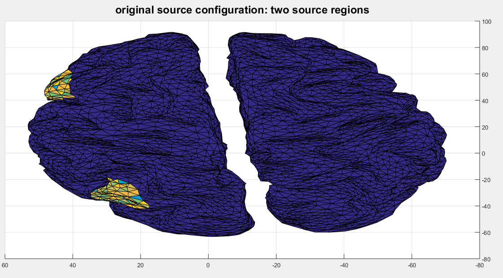

<h1>Blind Source Separation for EEG signal</h1>

In this repository, you will find the application of the MNE and SISSY algorithms to the problem of localizing the active dipoles in an EEG signal (which is modeled as the superposition of the activity of all the existing dipoles).

The algorithms are tested for different SNR and for white and colored noise. The DLE (Dipole Localization Error) criterion is used for evaluation.

